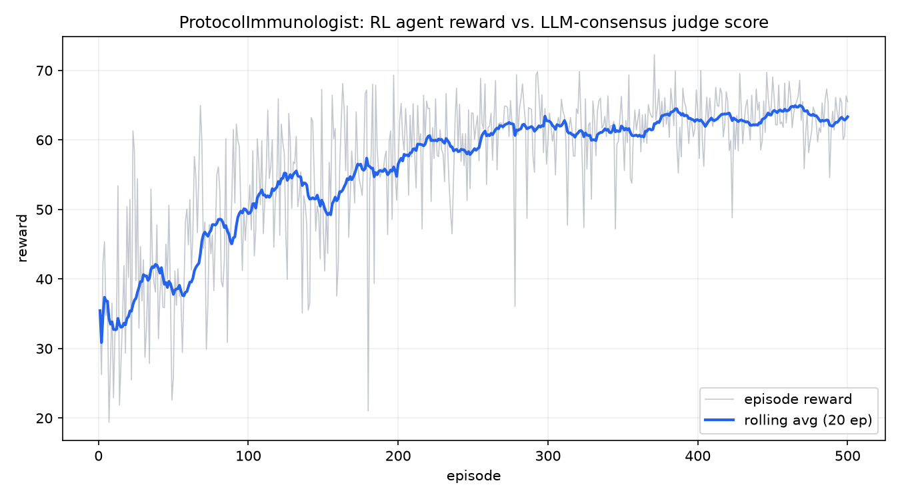

# genlayer-rl-protocol-immunologist

[](LICENSE)
[](https://www.python.org/)
[](https://genlayer.com)

Part of [GenLayer RL Agent Autonomy](https://github.com/luch91-org)
 - a family of independent repos that train reinforcement learning agents
against LLM-consensus reward functions on GenLayer. See the [org
profile](https://github.com/luch91-org/.github) for the
full picture; this repo is domain 2 of 4.

## What this is

A DAO treasury defense environment. An off-chain RL agent guards a
1,000,000-unit treasury while a threat level (green / yellow / red)
shifts under it. It can pause the protocol, rotate multisig signers,
hedge funds into a safe reserve, or do nothing - and a red alert drains
10% of whatever is un-hedged and un-paused that round. Every decision is
scored 0-10 by an LLM judge running inside a GenLayer Intelligent
Contract, with a committee of validators reaching consensus on the score.
The judge explicitly punishes paranoia (pausing on green) and inaction
(losing funds on red) - the agent has to learn *when* protection is
warranted, not just how to protect.

## The loop

```
   off-chain (your machine)                  on-chain (GenLayer)
 ┌───────────────────────────┐        ┌──────────────────────────────┐
 │  RL agent                 │  read  │  ProtocolImmunologist         │
 │  - reads state             │<─────  │  - treasury, signers, alert   │
 │  - picks an action (ε-greedy)       │  - applies the action         │
 │  - updates Q-table         │  write │  - red alert drains unhedged  │
 │    from the reward         │─────>  │    funds unless paused        │
 │                            │        │  - LEADER LLM scores it 0-10  │
 │                            │ reward │  - VALIDATORS agree via       │
 │                            │<─────  │    eq_principle, reward saved │
 └───────────────────────────┘        └──────────────────────────────┘
```

**The reward function is immutable once deployed.** The agent optimizes
it; it cannot edit it, and it never sees the rubric or the threat
schedule. That constraint is the safety property that makes this loop
meaningful.

## Prerequisites

- Python >= 3.12 (`genlayer-py` needs it at import time - earlier
  Pythons fail at import, not at `pip install`).
- The [GenLayer CLI](https://docs.genlayer.com/developers/intelligent-contracts/tools/genlayer-cli)
  (`npm install -g genlayer`) only if you prefer `genlayer deploy` over
  the bundled pure-Python `agent/deploy.py`.
- A GenLayer network for `--env genlayer`: local
  [Studio](https://studio.genlayer.com), the hosted studionet, or a
  testnet. Not required for `--env mock`.

## Setup

```bash
git clone https://github.com/luch91-org/genlayer-rl-protocol-immunologist.git
cd genlayer-rl-protocol-immunologist
python -m venv .venv
source .venv/bin/activate   # .venv\Scripts\activate on Windows
pip install -r agent/requirements.txt
```

Lint and test:

```bash
black --check .
isort --check-only .
pytest tests/ -v
```

Train against the free, instant mock environment (default, no network):

```bash
python -m agent.train --env mock --episodes 500
python -m agent.plot
```

This writes `logs/training.txt`, `agent/q_table.json`, and
`docs/learning_curve.png`.

Deploy the contract and train against the real chain:

```bash
# Option A: GenLayer CLI (needs Node)
genlayer deploy --contract contracts/protocol_immunologist.py

# Option B: pure-Python deploy helper
python -m agent.deploy --chain studionet

# then, with the printed address:
python -m agent.train --env genlayer --chain studionet --address 0x... --episodes 3 --max-steps 4
```

## Sample training log

```
episode=1 reward=35.45 rolling_avg=35.45 epsilon=0.9900 reason='hedged heavily with no threat in sight'
episode=10 reward=22.94 rolling_avg=32.75 epsilon=0.9044 reason='routine signer rotation on a green alert'
episode=100 reward=49.34 rolling_avg=49.42 epsilon=0.3660 reason='kept operations running smoothly on green'
episode=300 reward=59.89 rolling_avg=62.73 epsilon=0.0490 reason='paused during a red alert'
episode=500 reward=65.51 rolling_avg=63.33 epsilon=0.0100 reason='kept operations running smoothly on green'
Training complete: 500 episodes in 0.3s, env=mock, states_seen=32, final_rolling_avg=63.333, final_epsilon=0.0100
```

(Real output from `python -m agent.train --env mock --episodes 500 --seed
42`. Episode reward sums over 8 steps; divide by 8 for a per-step score - 
the rolling per-step average climbs from roughly 4 in early, mostly-random
episodes to around 8 once the policy converges. MockEnv's alert
transitions are random, so the ceiling varies a little run to run; without
`--seed` your exact numbers will differ.)



## Verified live deployment

This exact contract has been deployed and exercised end-to-end against
the hosted GenLayer Studio network (`https://studio.genlayer.com/api`,
chain `studionet`), 2026-07-03, at:

```
0x4213C3915a314B7A4ef926895A08638F54aE55dd
```

Sample live step - one on-chain transaction, LLM-judged and
validator-agreed in ~50 s:

```
action: {'type': 'hedge', 'amount': 250000}   (alert was green)
reward=7.0
reason='Moderate hedge preserved capital with no loss, but taking a
        sizable 25% hedge on a green alert was somewhat overcautious and
        reduced continuity efficiency.'
```

Note the judge doing exactly what the rubric asks: capital was preserved,
but hedging heavily on a *green* alert was called out as overcaution.

A short live training run (3 episodes × 4 steps = 12 on-chain
LLM-consensus transactions, 706.7 s total, ~59 s/step) is committed at
[`logs/training_live_studionet.txt`](logs/training_live_studionet.txt):

```
episode=1 reward=21.000 rolling_avg=21.000 epsilon=0.8000 reason='While no funds were lost, the treasury remains paused during'
episode=2 reward=19.000 rolling_avg=20.000 epsilon=0.6400 reason='The action correctly protected the treasury during a red ale'
episode=3 reward=22.000 rolling_avg=20.667 epsilon=0.5120 reason='Pausing during a red alert is exactly the right decisive pro'
Training complete: 3 episodes in 706.7s, env=genlayer, states_seen=10, final_rolling_avg=20.667, final_epsilon=0.5120
```

Three episodes at ε≈0.5-0.8 is still mostly exploration, so expect noise
(episode 2 dipped); the final episode is the highest, and the judge's
reasons show it rewarding exactly the intended behavior. The hosted
Studio network is a shared sandbox that may be reset at any time - if the
address above stops resolving, redeploy with `python -m agent.deploy
--chain studionet` and substitute your fresh address.

## Repository layout

```
.
├── contracts/
│   ├── protocol_immunologist.py  # the Intelligent Contract (GenVM-only)
│   └── logic.py                   # loader: execs the real contract source, stubbed genlayer
├── agent/
│   ├── env.py                     # Env protocol + MockEnv + GenLayerEnv
│   ├── agent.py                    # tabular Q-learning
│   ├── train.py                    # python -m agent.train
│   ├── plot.py                     # python -m agent.plot
│   ├── deploy.py                    # python -m agent.deploy
│   └── requirements.txt
├── tests/
│   ├── test_contract.py
│   └── test_agent.py
├── docs/
│   ├── tutorial.md
│   └── learning_curve.png
├── logs/training.txt
├── CLAUDE.md
└── .github/workflows/ci.yml
```

See [docs/tutorial.md](docs/tutorial.md) for the contract deep dive, the
deterministic-threat-schedule consensus constraint, GenVM storage/float
rules, and hyperparameter tuning.

## Versioning

Semantic versioning; first tag `v0.1.0-alpha`. Trained `agent/q_table.json`
is attached to each GitHub Release so a reviewer can load a working agent
without retraining.

## Contributing

Issues and Discussions are open. See the [org profile](https://github.com/luch91-org/.github)
for how this repo fits into the broader GenLayer RL Agent Autonomy project.
